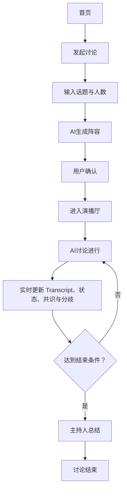

# AI Panel Studio MVP 产品需求说明书（PRD）

> SDD 阶段基线｜v1.0｜2026-09-09。需求来源：`docs/00-mvp-development-brief.md`；本文不代表任何功能已实现。

## 1. 产品概述

**产品名称**：AI Panel Studio。

**一句话定位**：用户输入话题和专家人数、确认 AI 生成的主持人与专家阵容后，在本地 Web 演播厅实时观看多视角讨论、共识与分歧演化。

**核心价值**：以差异化专家立场弥补单一 AI 的视角局限；将讨论过程以实时 Transcript、状态、共识和分歧呈现；使多个议题可并行观察且不串场。

| 目标用户 | 情境 | 核心诉求 |
| -- | -- | -- |
| 知识工作者、研究人员 | 快速审视复杂议题 | 获得多角度分析与争辩摘要 |
| 产品、决策人员 | 方案评审、战略预演 | 发现盲点、检验假设 |
| 教育、内容创作者 | 结构化呈现议题 | 获得具备过程感的虚拟专家讨论 |

**用户核心问题**：单一 AI 视角单一；分别询问多个角色没有共享上下文；只看结论缺少观点碰撞过程；多议题并行时上下文与结论易混淆。

## 2. MVP 目标

本次远程作业的 MVP 不追求完整商业产品，而验证：用户能快速创建一场 AI 圆桌；AI 能生成差异化主持人与专家；多专家讨论具有非机械轮流的实时感；用户可实时看到观点碰撞、共识与分歧；多个 Discussion 能独立运行。

> 设计决策：专家人数范围为 2–8（不含主持人），默认 4；每场讨论最多生成 15 条公开发言，随后进入收束。以上为开发者确认后的 MVP 配置。

## 3. 核心用户流程

1. 首页展示全部 Discussion（包含已结束讨论），用户可观察或发起新讨论。
2. 创建页校验非空话题和专家数，创建草稿 Discussion。
3. 后端调用模型生成 1 名主持人和指定数量专家；用户查看姓名、职业/Title、立场、颜色。
4. 用户确认合规阵容后进入演播厅并显式启动讨论。
5. 演播厅订阅本 Discussion 的 SSE；主持人开场，模型依据本场 Transcript、嘉宾立场和当前观点选择下一位发言者。
6. 每轮保存发言并实时更新 Transcript、公开状态和 Insights；最多 15 条公开发言后主持人自然语言总结。总结失败时先重试一次，仍失败则降级为“总结暂不可用”，并允许用户重试。

## 4. 功能需求

### 首页

- **目的**：进入应用、查看或观察任意 Discussion。
- **输入**：讨论列表请求。
- **核心行为**：展示所有 Discussion 的主题、状态、参与人数、最近活动时间，提供观察与创建入口；已结束讨论为只读观察。
- **输出**：运行中 Discussion 列表或空状态。
- **关键异常**：加载失败可重试；空列表不伪造为真实讨论。

### 创建讨论

- **目的**：收集最小创建参数。
- **输入**：`topic`、可选 `expert_count`。
- **核心行为**：校验话题非空、长度受限，人数在 2–8 内；未传人数时使用默认值 4；创建 `DRAFT`。
- **输出**：草稿 Discussion。
- **关键异常**：字段非法给出字段级错误，失败不进入确认页。

### 嘉宾生成

- **目的**：生成可确认阵容。
- **输入**：话题、专家人数。
- **核心行为**：首次在草稿生成阵容；在 `CAST_READY` 可重新生成。重新生成须先完整生成和校验，成功后原子替换旧 Participant 并取消确认；失败时保留旧阵容。
- **输出**：`CAST_READY` 与 Participant 列表。
- **关键异常**：模型超时/非法结构/人数不符时保持草稿，不产出半成品阵容。

### 阵容确认

- **目的**：由用户决定采用当前阵容。
- **输入**：Discussion ID。
- **核心行为**：仅允许确认尚未确认的合规 `CAST_READY` 阵容；确认信息持久化，允许重新生成后再确认。
- **输出**：已确认标识与演播厅地址。
- **关键异常**：草稿、运行中、已结束或已确认的重复确认返回冲突。

### 演播厅

- **目的**：沉浸式集中呈现讨论。
- **输入**：聚合快照、专属 SSE。
- **核心行为**：显示主题、嘉宾小窗、Transcript、共识、分歧、总结；中文响应式布局，各区域独立滚动。
- **输出**：与当前 Discussion 对齐的可观察现场。
- **关键异常**：SSE 中断后由浏览器重连；每次连接以服务端快照恢复当前展示，快照失败可重试。

### 专家实时状态

- **目的**：展示实时感，且不泄露隐藏推理。
- **输入**：`idle`、`preparing`、`speaking` 与 `public_focus`。
- **核心行为**：每位专家独立小窗显示状态和模型生成的公开关注点；主持人亦可显示。公开关注点仅是面向观众的一句简短摘要，不是隐藏推理。
- **输出**：Participant 局部更新。
- **关键异常**：未知或跨 Discussion 事件丢弃。

### Transcript

- **目的**：提供可追踪的现场记录。
- **输入**：有序 Utterance。
- **核心行为**：按 `sequence` 追加；显示姓名、职业/Title 与专属色块；每次发言为 1–2 句；不显示举手等内部事件。
- **输出**：有序发言流。
- **关键异常**：按 `sequence` 排序；未知发言人不得当作正常发言渲染。

### 实时共识

- **目的**：展示逐步形成的共同判断。
- **输入**：活跃 `consensus` Insight。
- **核心行为**：每轮接收并展示模型返回的当前活跃共识集合，每类最多两项，避免无限堆积。
- **输出**：当前活跃共识。
- **关键异常**：提炼失败不阻塞已保存发言，保留最近有效值。

### 实时分歧

- **目的**：展示尚未解决的对立。
- **输入**：活跃 `disagreement` Insight。
- **核心行为**：每轮接收并展示模型返回的当前活跃分歧集合，每类最多两项。
- **输出**：当前活跃分歧。
- **关键异常**：提炼失败不阻塞已保存发言，保留上一轮有效集合。

### 主持人总结

- **目的**：收束讨论。
- **输入**：Transcript 与 Insights。
- **核心行为**：结束时生成并保存自然语言总结，页面不显示模型 JSON 原文；首次失败后自动重试一次，降级后允许用户显式重试总结。
- **输出**：`summary`、`FINISHED`。
- **关键异常**：重试仍失败时 Discussion 仍结束、显示“总结暂不可用”，并保留“重试总结”入口。

### 多讨论并行

- **目的**：支持同时探索议题。
- **输入**：不同 Discussion ID 的请求和 SSE。
- **核心行为**：每场有独立 Runner、事件流和查询范围。
- **输出**：互不串场的演播厅。
- **关键异常**：一个 Runner/模型调用失败只能影响自身 Discussion。

## 5. 非功能需求

- **API Key 安全**：只在后端环境变量读取，浏览器、REST、SSE、日志均不得泄露。
- **数据隔离**：所有读写、事件、前端缓存以 `discussion_id` 为边界。
- **实时性**：一轮内容成功持久化后立即推送；不承诺固定模型响应 SLA。
- **响应式与滚动**：中文 UI；不依赖整页滚动，Transcript、嘉宾、Insight 区独立滚动。
- **错误处理**：统一错误 JSON；SSE 有错误事件；前端提供可操作提示。
- **可测试性**：LLM 可替换 Fake；pytest 验证核心逻辑，Playwright 验证关键流程。
- **本地运行**：前后端分离，SQLite 与环境变量可在本机运行。
- **AI 输出稳定性**：机器消费内容先结构化 JSON、后 Pydantic 校验。

## 6. MVP 明确不做

- 用户账号、权限、邀请、支付、云端部署和运营后台。
- 跨 Discussion 长期记忆、历史检索、复杂搜索与社交互动。
- 音视频、真人语音、录制导出、真实直播。
- 用户编辑 AI 发言、复杂阵容编辑、模板市场和多模型路由。
- 无限自治 Agent、无限时长讨论或人工实时插话。

> 设计决策：首页展示全部 Discussion；`FINISHED` 讨论只读，`FAILED` 讨论显示错误状态，不自动恢复。

## 7. 验收标准

- [ ] 当用户打开首页时，系统应展示所有 Discussion（包括 `FINISHED`），并提供观察和发起入口。
- [ ] 当用户提交合法话题和人数时，系统应创建草稿；非法输入应有明确错误。
- [ ] 当用户生成嘉宾时，系统应返回一名主持人与指定数量、信息完整且立场有差异的专家。
- [ ] 当用户确认合规阵容时，系统应进入对应演播厅。
- [ ] 当讨论开始时，主持人应完成开场、串联/追问与收尾职责。
- [ ] 当专家发言时，系统应以姓名、职业/Title、专属颜色显示 1–2 句发言。
- [ ] 当讨论进行时，发言顺序应反映上下文中的补充、质疑或反驳，而非固定轮询。
- [ ] 当讨论运行时，系统应实时展示待机、准备发言、发言中和公开关注点，不展示隐藏 CoT。
- [ ] 当新增发言保存时，Transcript、共识/分歧应实时更新，无须等结束。
- [ ] 当公开发言达到 15 条或用户停止时，系统应停止自动发言并进入收束。
- [ ] 当总结生成失败时，系统应自动重试一次；仍失败时应降级结束，并允许用户发起重试总结。
- [ ] 当两场讨论同时运行时，任一页面只接收自身数据和事件。
- [ ] 当 API Key 配置时，密钥应只存在于后端环境变量。
- [ ] 当在窄屏、桌面、超宽屏访问时，演播厅主要区域应可用且独立滚动。
