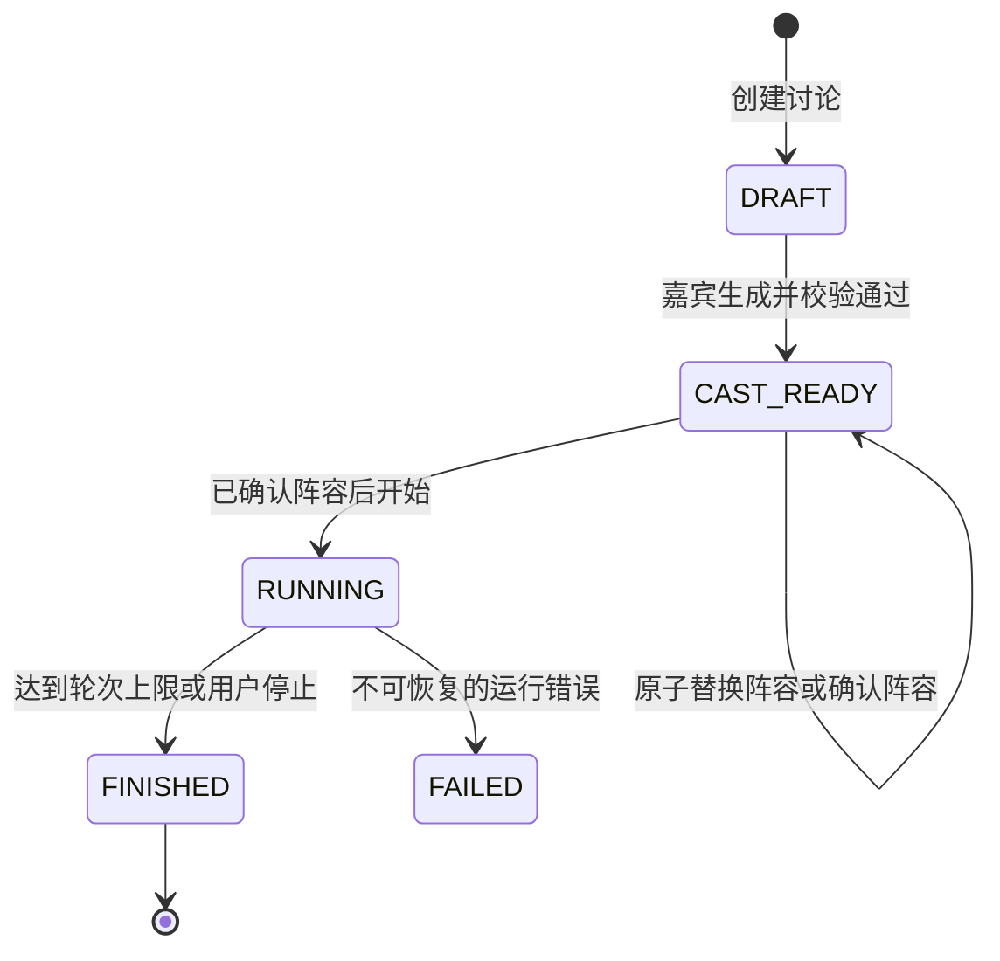
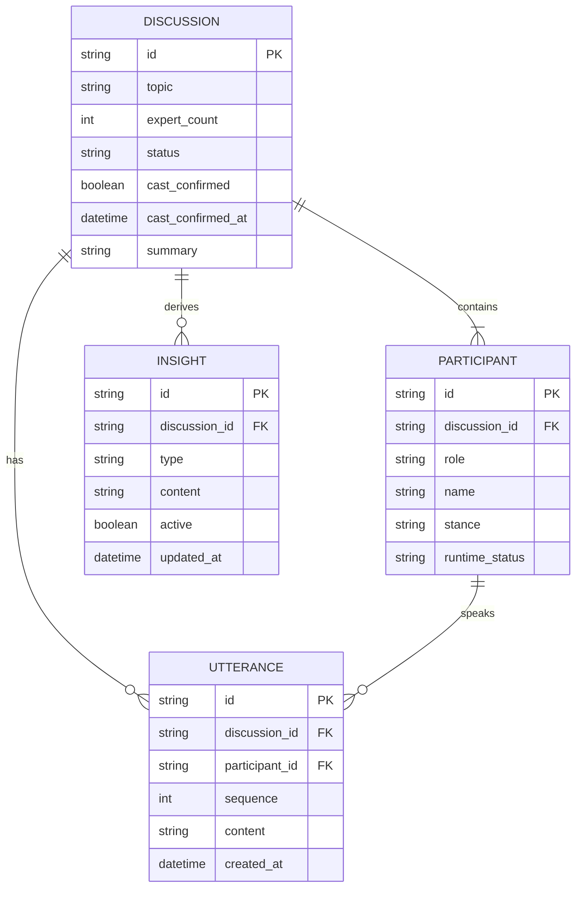

# AI Panel Studio MVP 领域模型与数据模型设计

> SDD 阶段基线｜v1.0。本文描述目标模型，不代表数据库或代码已经存在。

## 1. 领域边界

**Discussion（讨论）**是核心聚合根：它代表一次可独立创建、运行和观察的圆桌。其 Participants、Utterances、Insights、Runtime State、Event Stream 均只属于该 Discussion。所有 API 查询条件、数据库外键、Runner 注册表和前端状态都以 `discussion_id` 为隔离键，禁止跨场引用。

不额外引入持久化“会话”“房间”实体：MVP 中它们与 Discussion 语义重复。`DiscussionRuntime` 与 `SSESubscriber` 是运行对象，不是领域历史。

## 2. Discussion 生命周期

| 状态 | 允许动作 | 转换触发 |
| -- | -- | -- |
| `DRAFT` | 编辑参数、生成阵容 | 生成并校验成功到 `CAST_READY` |
| `CAST_READY` | 查看、确认、重新生成 | 确认后仍为 `CAST_READY`；仅已确认阵容可启动至 `RUNNING` |
| `RUNNING` | 订阅、观察、停止 | 正常/受控收束到 `FINISHED`；不可恢复错误到 `FAILED` |
| `FINISHED` | 只读查看 | 不自动再启动 |
| `FAILED` | 只读查看错误 | 不提供恢复或继续讨论；用户可创建新 Discussion |

> 架构决策：保留 `FAILED` 以区分正常结束与不可恢复失败；不设置 `STOPPED`，用户停止也需收束，最终统一为 `FINISHED`，减少状态分支。

不合法转换返回 `409 DISCUSSION_STATE_CONFLICT`，不得跳过确认或重复启动。

## 3. 实体定义

### Discussion

职责：承载话题、生命周期和总结，并维护本场集合完整性。

| 字段 | 类型 | 必填 | 约束/含义 |
| -- | -- | -- | -- |
| `id` | UUID 字符串 | 是 | 服务端生成的主键 |
| `topic` | 字符串 | 是 | trim 后非空，建议 1–300 字符 |
| `expert_count` | 整数 | 是 | 不含主持人；范围 2–8，默认 4 |
| `max_public_utterances` | 整数 | 是 | 固定为 15；本场公开发言上限 |
| `status` | 枚举 | 是 | `DRAFT`/`CAST_READY`/`RUNNING`/`FINISHED`/`FAILED` |
| `cast_confirmed` | 布尔 | 是 | 默认 false；`RUNNING` 前必须为 true |
| `cast_confirmed_at` | UTC datetime/null | 否 | confirm 成功时写入；false 时必须为 null |
| `summary` | 字符串/null | 否 | 结束后的自然语言总结 |
| `summary_status` | 枚举 | 是 | `pending`/`succeeded`/`fallback`；`fallback` 时允许重试 |
| `error_code` | 字符串/null | 否 | 失败诊断码，不含密钥或提示词 |
| `created_at` | UTC datetime | 是 | 创建时间 |
| `updated_at` | UTC datetime | 是 | 最后持久化变更时间 |
| `started_at` | UTC datetime/null | 否 | 开始运行时间 |
| `finished_at` | UTC datetime/null | 否 | 正常/受控结束时间 |

### Participant

职责：表示主持人或专家的公开角色设定及可展示最新状态。

| 字段 | 类型 | 必填 | 约束/含义 |
| -- | -- | -- | -- |
| `id` | UUID 字符串 | 是 | 主键 |
| `discussion_id` | UUID 字符串 | 是 | 外键；不可跨讨论修改 |
| `role` | 枚举 | 是 | `moderator` 或 `expert` |
| `name` | 字符串 | 是 | Discussion 内建议唯一的展示名 |
| `profession` | 字符串 | 是 | 职业/领域 |
| `title` | 字符串 | 是 | 职位头衔 |
| `stance` | 字符串 | 是 | 本讨论主要立场，不是隐藏推理 |
| `color` | CSS HEX | 是 | `^#[0-9A-Fa-f]{6}$`；本场唯一 |
| `runtime_status` | 枚举 | 是 | `idle`/`preparing`/`speaking` |
| `public_focus` | 字符串/null | 否 | 用户可见简短关注点，不能含 CoT |
| `created_at` | UTC datetime | 是 | 创建时间 |

> 设计假设：最新 `runtime_status` 与 `public_focus` 持久化以支持刷新；真正调度上下文、task、订阅者仅留内存。

### Utterance

职责：保存可公开展示的单次发言，形成不可变 Transcript。

| 字段 | 类型 | 必填 | 约束/含义 |
| -- | -- | -- | -- |
| `id` | UUID 字符串 | 是 | 主键及 SSE 去重键 |
| `discussion_id` | UUID 字符串 | 是 | 外键，须与 participant 所属讨论一致 |
| `participant_id` | UUID 字符串 | 是 | 发言人外键 |
| `sequence` | 整数 | 是 | 本场从 1 单调递增且唯一 |
| `content` | 字符串 | 是 | 已校验公开发言；1–2 句、建议最大 300 字符 |
| `created_at` | UTC datetime | 是 | 持久化成功时间 |

内部意图（如 `challenge`）不存入 Utterance，以免泄露到页面/对外契约。

### Insight

职责：保存当前有效的共识或分歧；同义观点更新旧记录，而不是无限追加。

| 字段 | 类型 | 必填 | 约束/含义 |
| -- | -- | -- | -- |
| `id` | UUID 字符串 | 是 | 主键 |
| `discussion_id` | UUID 字符串 | 是 | 外键 |
| `type` | 枚举 | 是 | `consensus` 或 `disagreement` |
| `content` | 字符串 | 是 | 面向用户的简短观点 |
| `active` | 布尔 | 是 | 当前是否展示 |
| `created_at` | UTC datetime | 是 | 首次提炼时间 |
| `updated_at` | UTC datetime | 是 | 最近修订时间 |

## 4. ER 图

## 5. 领域规则

1. 每场 `CAST_READY`、`RUNNING`、`FINISHED` Discussion 有且仅有一名主持人。
2. 专家数必须等于 `expert_count`，主持人不计入该数。
3. Participant 只能属于一个 Discussion，且不可跨场复用。
4. Utterance 必须属于一个 Discussion 和一个 Participant，二者 `discussion_id` 必须相等。
5. Insight 只能属于一个 Discussion，`type` 仅能为两种合法枚举。
6. 所有子资源查询必须附父 `discussion_id` 条件，禁止跨 Discussion 引用。
7. `sequence` 本场唯一、递增；已保存 Utterance 不改写。
8. `/confirm` 仅可作用于合规 `CAST_READY`，并持久化 `cast_confirmed=true` 与 `cast_confirmed_at`；`/start` 仅允许 `CAST_READY + cast_confirmed=true`。
9. `CAST_READY` 重新生成阵容时，服务端先在内存生成并校验；成功后在单一事务中替换全体 Participant、重置确认字段为 false，状态保持 `CAST_READY`。生成/校验失败必须保留旧阵容与确认状态。
10. 仅 `RUNNING` 可自动追加发言/更新 Insight；累计 15 条 Utterance 后必须进入收束；`FINISHED` 不再自动生成发言。
11. 不可恢复 Runner 异常及连续调度/发言校验失败必须进入 `FAILED`，不提供恢复；Insight 提炼失败不影响已保存发言及下一轮。
12. `FINISHED` 必须有 `finished_at`；总结成功则 `summary_status=succeeded`。`summary_status=fallback` 可在不改变 Discussion 生命周期的情况下重试总结。
13. `public_focus` 仅可为公开摘要，禁止存储或下发隐藏推理。

## 6. 运行时状态与持久化状态

| 类别 | 内容 | 存放位置 | 原因 |
| -- | -- | -- | -- |
| 持久化领域事实 | 四个实体及最新公开状态 | SQLite | 刷新、重连、重启后可恢复展示 |
| 运行协调 | `DiscussionRunner`、当前轮数、上下文窗口、取消标记 | 进程内按 ID 注册表 | 短生命周期，不是业务历史 |
| 连接状态 | SSE subscriber、连接队列、心跳 | 进程内 EventHub | 仅连接存活期间有意义 |
| 异步控制 | LLM task、pending task、锁 | Runner 内存 | 防重复启动、受控停止 |

进程重启后发现 `RUNNING` 但不存在 Runner 的记录，不得假装继续；MVP 启动时必须标记为 `FAILED`（如 `RUNNER_RECOVERY_REQUIRED`），不恢复 Runner。
