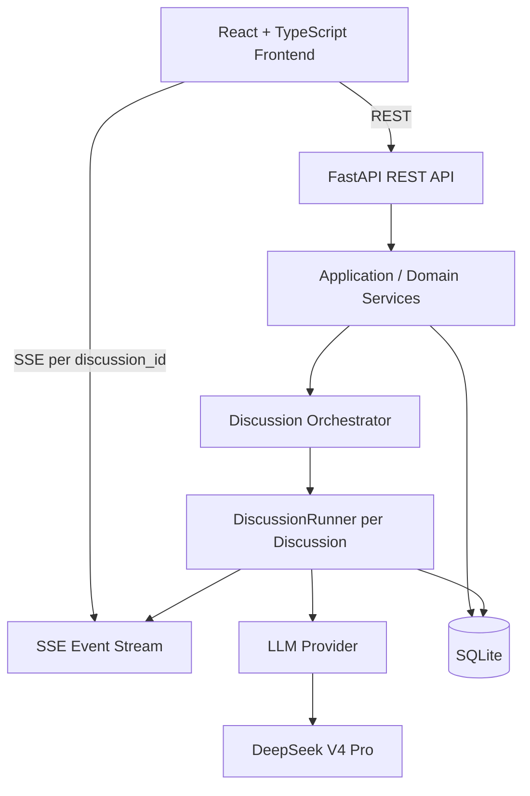
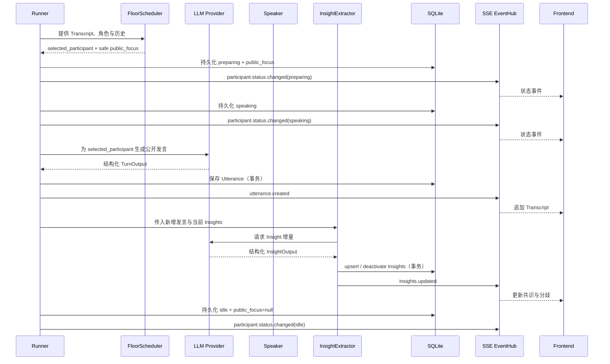

# AI Panel Studio MVP 系统架构与 AI 调度设计

> SDD 阶段基线｜v1.0。目标是 72 小时内由单人借助 Claude Code 与 DeepSeek V4 Pro 可实现、可测试、可演示的 MVP。

## 1. 总体架构



React 管理中文响应式 UI 与按 Discussion 隔离的客户端状态；首页读取所有 Discussion，已结束讨论只读；FastAPI 提供命令/查询 REST 和 SSE；应用服务校验状态、持久化聚合并协调 Runner；Runner 推动讨论；Provider 隔离模型 SDK；SQLite 保存领域事实。

> 架构决策：一场 Discussion 一个只读 SSE 流，用户操作走 REST。相对 WebSocket，SSE 足以满足服务器持续推送现场状态的 MVP，浏览器与测试实现更简洁。

## 2. 目录结构建议

```text
backend/
  app/
    api/              # FastAPI routers、SSE endpoint、请求/响应 Schema
    domain/           # 实体、枚举、领域规则
    services/         # 应用服务、事务边界
    repositories/     # SQLAlchemy 持久化访问
    llm/              # Provider 接口、DeepSeek、Fake、输出 Schema
    runtime/          # Runner、EventHub、取消和并发控制
    main.py
  tests/              # pytest：领域、服务、API、Runner
frontend/
  src/
    api/              # REST、EventSource 客户端
    features/         # home、create-discussion、studio
    components/       # shadcn/ui 组合组件
    stores/           # 按 discussion_id 的客户端状态
    types/            # 与 API 契约对应的 TypeScript 类型
    App.tsx
e2e/                  # Playwright 关键用户路径
docs/
```

不拆微服务、消息队列或独立 Agent 进程；按职责适度分层，保留可替换和可测试边界。

## 3. LLM Provider 抽象

```text
LLMProvider
  ├─ generate_cast(input) -> CastOutput
  ├─ generate_turn(input, selected_participant) -> TurnOutput
  ├─ extract_insights(input) -> InsightOutput
  └─ summarize(input) -> SummaryOutput

DeepSeekLLMProvider：调用 DeepSeek V4 Pro
FakeLLMProvider：返回受控数据，服务于测试/演示
```

真实模型有费用、网络、限流和非确定性，pytest/Playwright 不能依赖它。Fake 应能模拟正常、非法 JSON、超长发言、重复 Insight、上游失败，保证核心规则可重复验证。

## 4. AI 核心模块

### CastGenerator

输入为 `topic`、`expert_count`；输出一个主持人与专家候选，字段为角色、姓名、职业、Title、立场、颜色。服务端校验一名主持人、人数准确、颜色唯一、文本合规后才持久化。

### FloorScheduler

FloorScheduler 是进程内确定性候选选择器，而非一次额外模型调用；它是 `public_focus` 的唯一来源。候选确定后，Runner 立即持久化该 Participant 的安全关注点并发布 `preparing`/`speaking` 状态，再调用一次 `generate_turn(input, selected_participant)`。`TurnOutput` **只**包含该角色 1–2 句公开发言及是否结束；不含 speaker、`public_focus`、intent 或其他内部字段。

候选规则固定为可测试的窗口 `2`：首轮必为主持人；之后先排除上一位 speaker，若候选仍多于一人再排除最近两条 Utterance 的 speaker。若最新发言以 `？` 或 `?` 结束，优先专家；若最新发言人为主持人，同样优先专家；其余情况下，只有自上次主持人发言后已出现至少 2 位专家发言时才优先主持人，否则优先专家。在优先角色的候选中，按“发言次数最少 → 最近一次发言 sequence 最小（最久未发言）→ Participant ID 升序”选择；若优先角色无候选，再对全部合格候选用同一评分。每个分支同时生成固定安全 `public_focus`：回答问题为“正在回应当前问题”，专家补充为“正在补充不同视角”，主持人串联为“正在串联当前观点”。这样调度可利用 Transcript 的末条句式、角色和历史，同时避免固定轮转。Runner 累计到第 15 条公开发言时必须转入收束，不再调度新的专家发言。

> 架构决策：采用“确定性候选选择 + 单次模型发言输出 + 服务端硬约束”。不合规输出最多校正重试一次；仍失败即以 `discussion.error` 结束为 `FAILED`。这避免额外模型调用、无限等待和伪造无限自治能力。

### InsightExtractor

输入新增 Utterance 与现有活跃 Insight；输出结构化 `upsert` 和 `deactivate` 操作。服务端按 ID 事务更新再发布事件。提示词目标为“当前仍有效的简短判断”，避免每轮无意义新增同义内容。

## 5. DiscussionRunner

每个运行中 Discussion 恰有一个 Runner：

```text
Discussion A -> Runner A -> Event Stream A
Discussion B -> Runner B -> Event Stream B
```

注册表以 `discussion_id` 为键，并通过进程内 `asyncio.Lock` 原子占位，防止重复启动；不实现容量调度系统。Runner 仅查询、修改、发布自身 ID；它拥有取消事件、当前 task、局部上下文。异常仅将自身置 `FAILED` 并广播错误，不能终止其他 Runner。后端重启时不恢复任何 Runner；启动检查发现遗留 `RUNNING` 记录必须标记为 `FAILED`。

> 架构决策：单进程内存 Runner 适合本地演示。生产多实例时需 Redis/数据库租约、任务队列、共享事件总线；MVP 不声称具备该能力。

## 6. 单轮讨论流程



固定单轮公开事件顺序为：`preparing` → `speaking` → 持久化 Utterance → `utterance.created` → `insights.updated`（若成功）→ 持久化 `idle + public_focus=null` → `participant.status.changed(idle)`。Utterance 持久化成功后才广播；Insight 失败不可回滚已保存发言，连续调度/发言校验失败或不可恢复 Runner 异常则进入 `FAILED`。

## 7. 专家状态设计

对用户只显示**待机、准备发言、发言中**及 `public_focus`，例如“正在回应当前问题”。这些是由 FloorScheduler 生成的受控公开摘要，而非模型推理。

禁止请求、存储、记录或下发隐藏 Chain-of-Thought。模型不返回 `public_focus`；服务端仅持久化 FloorScheduler 生成的固定安全关注点。内部调度理由、完整提示词、模型原始分析、token 信息均不属于前端契约。调试日志亦应脱敏。

## 8. 多讨论隔离

| 层面 | `discussion_id` 隔离做法 |
| -- | -- |
| Database | 子表外键；所有 repository 读写同时按父 ID 约束；校验 Utterance 的 speaker 归属 |
| Application Service | 命令先加载目标聚合并验证状态，不接受外部归属覆盖 |
| DiscussionRunner | 注册表、锁、取消事件、上下文、task 都按 ID 建立 |
| SSE | 专属 subscriber 集合，只向同 ID 广播；每个 event 强制带 ID |
| Frontend State | `Record<discussion_id, StudioState>` 或路由切片；先比对事件 ID 再消费 |

## 9. AI 输出 Schema

嘉宾、调度、发言、Insights、总结均要求模型输出 JSON，由 Pydantic 在 Provider 边界校验；领域层不直接信任模型自由文本或 JSON 原文。

| 场景 | 校验 | retry | fallback |
| -- | -- | -- | -- |
| 嘉宾 | 角色数、字段、颜色、长度 | 一次校正提示 | 返回错误，保持 `DRAFT` |
| 调度/发言 | speaker 归属、状态、句数、长度、公开字段安全 | 一次 | 仍失败为 `FAILED`；先持久化最终状态再发 `discussion.error` |
| Insight | 类型、操作、内容、目标 ID 归属 | 一次 | 跳过本轮，保留旧值 |
| 总结 | 自然语言、长度 | 一次 | 保存“总结暂不可用”、标记 `summary_status=fallback`，仍 `FINISHED`；可由 `retry-summary` 再次受理 |

不无限重试：每次模型调用最多一次校正重试，避免费用、延迟和卡死。

## 10. 风险与权衡

| 风险 | MVP 应对方案 | 生产环境改进 |
| -- | -- | -- |
| LLM 非确定性 | Structured Output、Pydantic、Fake 回归 | 模型评测集、版本锁定、可观测性 |
| 多讨论并发模型调用 | 每 Runner 独立 task；MVP 不做容量调度 | 队列、限流、分布式 worker |
| SSE 断线 | 重连后 GET 快照、事件 ID 去重 | Last-Event-ID 回放、持久事件日志 |
| 非法 JSON | 一次校正重试、错误码 | schema mode/函数调用、上游监控 |
| 发言过长 | 输出长度和句数校验 | token 预算、压缩、质量评测 |
| 专家立场趋同 | Cast 差异提示、调度携带 stance | 相似度检测和重生 |
| 机械轮流 | 上下文调度、连续/循环惩罚 | 学习型策略、人工标注 |
| Insight 无限重复 | upsert/deactivate、活跃集合上限 | 语义去重、观点图 |
| 页面不同步 | snapshot、去重、重连全量同步 | 事件序号、版本号、回放 |
| SQLite 并发限制 | 短事务、单机有限并发、验证后 WAL | PostgreSQL、连接池、队列写入 |

## 架构决策记录（ADR 摘要）

| 决策 | 选择 | 原因 | 被放弃方案 |
| -- | -- | -- | ----- |
| 前端框架 | React + TypeScript + Vite | 类型契约清晰，MVP 启动快 | 原生 JS、SSR 框架 |
| UI | Tailwind CSS + shadcn/ui | 快速构建响应式演播厅 | 自建全套设计系统 |
| 后端 | FastAPI + Pydantic | 契合 Python LLM/Schema 工作流 | Express、Django 全栈 |
| ORM | SQLAlchemy | 持久化与查询边界明确 | 直接 SQL、重型框架 |
| 数据库 | SQLite | 本地、零运维，适合单机 MVP | PostgreSQL、云数据库 |
| 实时通信 | SSE | 单向推送足够，实现/测试简单 | WebSocket、轮询 |
| 隔离边界 | Discussion 聚合 | 数据、Runner、事件天然同键 | Participant/全局会话 |
| 运行模型 | 独立 DiscussionRunner | 并行不串场，可受控停止 | 全局循环 |
| 模型抽象 | LLMProvider + DeepSeek/Fake | 隔离 SDK，可靠测试 | 业务层直调 SDK |
| 模型输出 | Structured JSON + Pydantic | 防止自由文本污染领域状态 | 正则解析自然语言 |
| 讨论上限 | 每场 15 条公开发言 | 保证演示时长、成本与收束可控 | 无限讨论 |
| 单元/服务测试 | pytest | 可确定性验证核心逻辑 | 仅手工验证 |
| 端到端测试 | Playwright | 验证 UI、REST/SSE、多讨论路径 | 仅 API 测试 |
