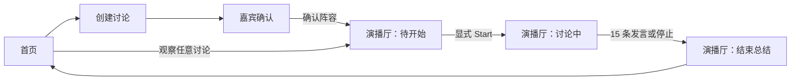
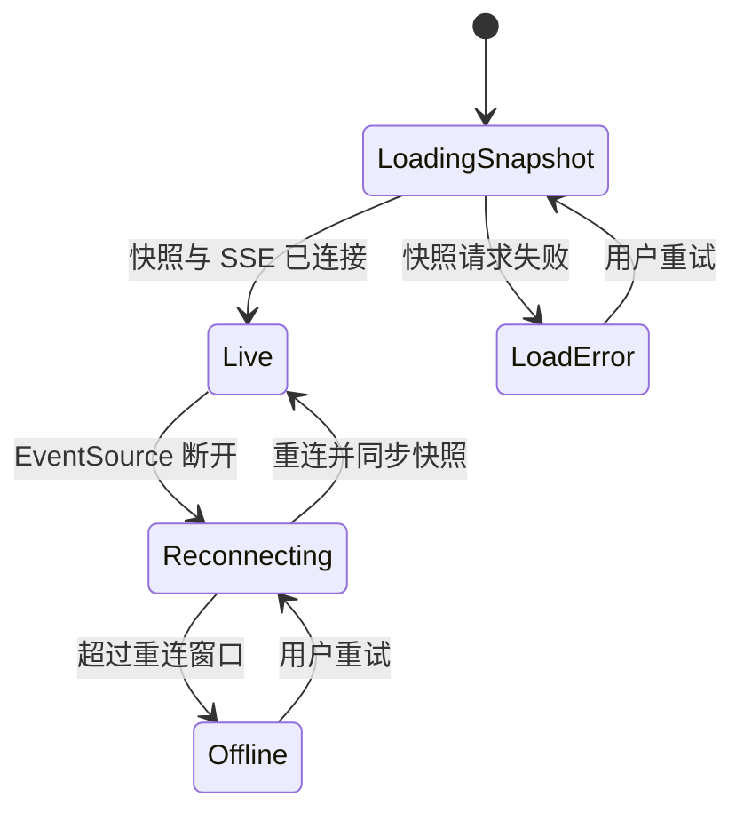

# AI Panel Studio MVP UI/UX 设计说明（DDD 阶段）

> 文档状态：DDD 阶段设计基线｜v1.0｜2026-09-09
>
> 依据：`docs/01-prd.md`、`docs/02-domain-model.md`、`docs/03-api-contract.md`、`docs/04-architecture.md`。本文只规定界面、交互与状态呈现，不改变既有产品流程、领域模型或技术架构，也不包含实现代码。

## 1. 设计目标与边界

### 1.1 体验目标

AI Panel Studio 的核心体验不是“聊天页面”，而是用户在观看一场正在发生的 AI 圆桌直播。设计应让用户在 3 秒内识别：**正在讨论什么、谁在发言、观点如何碰撞、讨论进展到哪里**。

- **现场感**：动态的嘉宾状态、最新发言强调与实时 Insight 更新共同传达讨论正在推进。
- **信息中心明确**：Transcript 是演播厅最大、视觉权重最高的区域；专家与 Insights 是理解上下文的辅助面板。
- **可信而克制**：展示公开状态与关注点，不将模型内部意图、举手事件或 Chain-of-Thought 伪装成真人思考过程。
- **可观察**：运行中、结束、降级错误、重连均有清晰状态，不以空白或无限 loading 掩盖。
- **MVP 克制**：不增加登录、评论、聊天室、音视频、手动编辑发言或未定义的控制能力。

### 1.2 页面与状态范围

| 页面/视图 | 核心任务 | 可见 Discussion 状态 |
| -- | -- | -- |
| 首页 | 浏览所有 Discussion，进入观察或创建 | 所有状态 |
| 创建讨论 | 输入话题和专家人数 | 创建前、`DRAFT` |
| 嘉宾确认 | 查看/重新生成/确认阵容 | `CAST_READY` |
| 演播厅 | 观察实时讨论或已结束回放快照 | `RUNNING`、`FINISHED`、`FAILED` |



> 设计决策：确认阵容后进入演播厅的“待开始”状态，Start 是显式主操作；不把确认与开始合并，确保用户明确看到阵容并可从容开始演示。

## 2. 信息架构与全局框架

### 2.1 全局导航

顶栏固定在应用内容区顶部，包含：左侧产品标识 `AI Panel Studio`（点击回首页）、中部当前页面标题或 Discussion 主题、右侧“发起讨论”主按钮。演播厅中顶栏右侧保留连接状态，不加入与 MVP 无关的设置、通知、账户入口。

| 元素 | 行为 | 约束 |
| -- | -- | -- |
| 产品标识 | 返回首页 | 不丢失运行中 Discussion，离开仅停止浏览 |
| 页面标题 | 首页显示“讨论现场”；演播厅截断显示话题 | 话题完整文本可通过 hover/focus 查看 |
| 发起讨论 | 进入创建页 | 演播厅中为次要按钮，不能覆盖 Start/停止操作 |
| SSE 状态 | 显示“实时连接 / 正在重连 / 已离线” | 仅传达连接状态，不暴露实现细节 |

### 2.2 视觉语言

整体采用“深色演播厅 + 高可读内容”的夜间现场风格：深色背景承担舞台感，卡片和文字使用中性灰层级；主持人与专家颜色只用于身份识别和实时活动提示，不应让彩色装饰压过内容。

| Token 类别 | 建议 | 用途 |
| -- | -- | -- |
| 画布 | `slate-950` 近黑蓝 | 演播厅与应用背景 |
| 表面 | `slate-900` / `slate-800` | 卡片、面板、浮层 |
| 边框 | 低对比 `slate-700` | 分区、非激活卡片 |
| 主文字 | `slate-50` | 主题、正文 |
| 次文字 | `slate-400` | 时间、职业、说明 |
| 主操作 | `indigo-500` 至 `indigo-600` | Start、确认、重试 |
| 成功/在线 | `emerald-400` | 实时连接、完成 |
| 警告 | `amber-400` | 正在重连、总结重试中 |
| 错误 | `rose-400` | 失败、无法加载 |

Participant 的 `color` 是身份色，必须保留其 API 值；仅用于头像边缘、姓名标识条、发言左侧色条和 speaking 环，不应用作大面积底色。所有文字仍须满足深色背景下可读性，身份色不能是判断状态的唯一方式。

### 2.3 排版与密度

- 字体：优先系统中文无衬线字体栈；不引入为 MVP 增加加载风险的远程字体依赖。
- 标题：页面标题 24–28px、600–700；Discussion 主题 18–22px、600。
- 正文：Transcript 16px、行高 1.65–1.8；面板正文 14px、行高约 1.6。
- 辅助文本：12–13px；不得低于 12px。
- 空间基准：采用 4px 间距尺度，常用间距为 8 / 12 / 16 / 24 / 32px。
- 讨论发言每条只允许 1–2 句的服务端内容；UI 不截断已合法的正文，仅在极窄屏自然换行。

## 3. 页面设计

### 3.1 首页：讨论现场

**目的**：让用户在列表中快速区分可实时观看的讨论与已结束讨论，并立即发起新讨论。

**布局**：顶栏下方是简短 Hero（标题、价值说明、主按钮），其下为“全部讨论”列表。桌面端使用 2–3 列 Discussion 卡片；窄屏为单列。默认按 `updated_at` 倒序，不增加搜索、筛选、分页等 MVP 外能力。

每张卡片包含：状态标签、主题、参与人数、最近更新时间，以及与状态对应的操作。

| Discussion 状态 | 视觉/文案 | 主操作 |
| -- | -- | -- |
| `DRAFT` | 灰色“草稿” | 继续创建 |
| `CAST_READY` | 靛蓝“待开始” | 查看阵容 |
| `RUNNING` | 绿点脉冲“直播中” | 进入现场 |
| `FINISHED` | 中性“已结束” | 查看回放 |
| `FAILED` | 红色“运行异常” | 查看详情 |

空状态应直接说明“还没有讨论现场”，并提供“发起第一场讨论”按钮；加载失败显示错误说明与“重新加载”。

### 3.2 创建讨论

**目的**：用最低输入成本建立草稿并触发阵容生成。

**布局**：居中、单栏表单，最大阅读宽度约 640px；桌面不铺满大屏。包含话题文本域、专家人数步进选择器、人数说明与主按钮“生成 AI 阵容”。

| 字段 | UI 规则 | 状态反馈 |
| -- | -- | -- |
| 讨论话题 | 多行文本域；提示“输入你希望圆桌讨论的问题” | 空值/超长显示字段下错误，不依赖 toast |
| 专家人数 | 减号、当前值、加号；范围 2–8；默认 4 | 到边界禁用相应按钮；标明“不含主持人” |
| 生成 AI 阵容 | 主按钮 | 提交中显示 loading 并禁用重复提交 |

点击生成后的交互为：创建 `DRAFT`，再请求生成阵容；页面保持在当前上下文，用全区 loading 展示“正在邀请主持人与专家…”。失败后保留用户输入，显示可重试的说明；不得跳转到空白确认页。

### 3.3 嘉宾确认

**目的**：让用户对阵容有足够信心后确认，不把模型生成结果直接当作无感跳转。

**布局**：顶部显示话题和“1 位主持人 + N 位专家”的计数；主持人卡片独占一行或视觉主位，专家卡片使用响应式网格。底部固定操作区包含“重新生成”和“确认阵容”。

Participant 卡片必须展示：身份（主持人/专家）、姓名、职业、Title、立场、身份色。立场以短段落展示，而非标签堆砌。卡片不显示 `runtime_status` 或 `public_focus`，因为讨论尚未开始。

| 操作 | 行为 | 反馈 |
| -- | -- | -- |
| 重新生成 | 回到生成过程，替换当前候选阵容 | 提示旧阵容将被替换；按钮 loading，防重复触发 |
| 确认阵容 | 调用 confirm，导航至对应演播厅 | 成功后显示待开始舞台；失败保留阵容并说明 |
| 返回首页 | 离开确认页 | 不删除已生成的 `CAST_READY` 阵容 |

### 3.4 演播厅：信息层级与线框

Transcript 是视觉中心，占据最高可用高度与最大列宽。嘉宾状态让用户理解“谁可能接话”，右侧 Insights 让用户感知讨论的收敛与冲突；两者均不能挤压 Transcript 至不可读。

```text
┌──────────────────────────────────────────────────────────────────────────────┐
│ AI Panel Studio   [讨论主题 …]              ● 实时连接   [发起讨论]          │
├──────────────────────────────────────────────────────────────────────────────┤
│ 直播中 · 7 / 15 条公开发言                              [停止讨论]          │
├──────────────────┬───────────────────────────────────────┬───────────────────┤
│ 嘉宾席           │ 现场 Transcript                        │ 观点面板          │
│ 主持人卡          │  发言色条 姓名 · 职业 / Title          │  已形成共识       │
│ 专家状态卡 × N   │  1–2 句内容                             │  · 条目           │
│ 待机/准备/发言中 │  …                                     │                   │
│ 公开关注点       │  最新发言 / 新消息提示                  │  关键分歧         │
│                  │                                       │  · 条目           │
└──────────────────┴───────────────────────────────────────┴───────────────────┘
```

#### 演播厅头部

显示主题、Discussion 状态和公开发言进度（如 `7 / 15 条公开发言`）。`RUNNING` 时提供危险样式的“停止讨论”并要求一次轻量确认；仅 `CAST_READY + cast_confirmed=true` 时显示唯一主按钮“开始讨论”。未确认的 `CAST_READY` 显示“请先确认阵容”及返回确认页入口；`FINISHED`/`FAILED` 不显示 Start 或停止。

#### 嘉宾席（Participant Rail）

主持人固定在首位，其余专家按 API participants 顺序排布。每张状态卡显示：头像占位（姓名首字或几何图形）、姓名、职业/Title、状态芯片、公开关注点。`speaking` 使用身份色细边框及低强度外发光；`preparing` 使用呼吸点；`idle` 保持静态。动画必须支持 `prefers-reduced-motion` 降级为无动画状态。

`public_focus` 为空时显示“等待讨论推进”，不显示“思考中”或推理过程。状态文字和图标同时出现，不能只依赖颜色/动画。

#### 现场 Transcript（主舞台）

发言按 `sequence` 升序；一条发言包含身份色左条、说话人姓名、职业/Title、相对时间和正文。最新一条可有 1 秒以内的淡入，但不使用逐字打字机效果，以免伪造流式模型过程或造成布局抖动。发言内容中不渲染任何内部 intent。

运行中首次为空时，显示主持人即将开场的舞台占位，不显示聊天输入框。结束后 Transcript 变为只读历史，保留完整可滚动内容。

#### 观点面板（Insight Rail）

分为“已形成共识”和“关键分歧”两张独立卡片，使用不同图标与柔和色调区分，但仍以文字标题区分。每项只显示 Insight `content`；不显示模型置信度、隐藏来源链或内部操作。空状态分别为“共识正在形成”“分歧尚未显现”。更新时仅对变更条目做短暂高亮，避免整栏闪烁。

### 3.5 演播厅结束与失败状态

| 状态 | 主区域表现 | 可用操作 |
| -- | -- | -- |
| `FINISHED` + `summary_status=succeeded` | 顶部“本场讨论已结束”；Transcript 后追加主持人总结卡 | 返回首页、发起讨论 |
| `FINISHED` + `summary_status=pending` | 总结卡骨架屏与“主持人正在整理总结” | 返回首页、等待 SSE 更新 |
| `FINISHED` + `summary_status=fallback` | 总结卡显示“总结暂不可用”，解释不影响既有讨论内容 | 重试总结、返回首页、发起讨论 |
| `FAILED` | 非阻塞错误横幅；保留已有 Transcript 和 Insights | 返回首页、发起新讨论；不提供继续讨论 |

“重试总结”仅在 `FINISHED` 且 `summary_status=fallback` 时可见，对应既定 `retry-summary` 契约。请求受理后按钮进入 loading、页面显示 pending，防止并发重复请求。

## 4. 响应式布局与独立滚动

### 4.1 断点规则

| 视口 | 布局 | 优先级 |
| -- | -- | -- |
| 超宽屏 `≥1440px` | 三列：嘉宾 280–320px / Transcript minmax(560px, 1fr) / Insights 280–320px | 让 Transcript 扩展，侧栏保持可扫描宽度 |
| 普通桌面 `1024–1439px` | 三列：嘉宾约 240px / Transcript 1fr / Insights 240px；空间不足时 Insights 可降至下方横栏 | 不牺牲 Transcript 正文宽度 |
| 平板/窄屏 `<1024px` | 单列主顺序：状态摘要 → Transcript → Insights；嘉宾横向可滚动轨道 | 先保证阅读发言，再提供辅助信息 |

> 设计决策：不为移动端另造功能或数据模型；只改变信息编排。窄屏不同时展示两个挤压的侧栏，避免 Transcript 退化成窄聊天气泡列。

### 4.2 高度与滚动规则

- 应用壳使用视口高度（动态视口高度兼容移动浏览器）；顶栏和演播厅头部固定，正文获得剩余高度。
- **桌面**：嘉宾席、Transcript、共识卡、分歧卡均在自身容器内滚动；页面外层不应因内容增长出现主滚动条。
- **窄屏**：演播厅仍锁定在视口高度内，不依赖整页滚动承载讨论内容；状态摘要、Transcript、Insights 纵向分区，各自使用受控高度与内部滚动，嘉宾使用横向轨道。
- 两个 Insight 卡片应各自可滚动，或在空间有限时共享“观点面板”滚动容器；不得裁切最后一项。
- 不隐藏滚动能力：滚动条可视觉弱化，但鼠标、触控板、键盘和触摸均可操作。

### 4.3 Transcript 自动滚动

1. 初始打开时，Transcript 定位到最新发言。
2. 用户位于底部附近时，新 Utterance 到达后自动滚到最新一条。
3. 用户主动向上查看历史时，暂停自动滚动，显示“有 N 条新发言”浮动按钮；点击后跳回底部。
4. 新 Insight 更新不改变 Transcript 滚动位置。
5. 已结束讨论不自动滚动。

“底部附近”的距离阈值应是一个明确常量（建议 80px），并在实现和 E2E 测试中统一；不得每次状态刷新都强制滚到底部。

## 5. 实时状态、Loading 与错误反馈

### 5.1 SSE 状态机（前端可见）



| 情形 | 呈现方式 | 用户动作 |
| -- | -- | -- |
| 首次加载聚合快照 | 页面骨架屏，保持标题骨架布局 | 无需操作 |
| 嘉宾生成中 | 阵容区骨架卡 + “正在邀请嘉宾” | 禁用重复生成 |
| Start 已受理、尚无发言 | 舞台占位 + “主持人正在开场” | 可返回首页；停止按钮按后端状态显示 |
| SSE 重连 | 顶栏黄色状态“正在重新连接”，保留历史内容 | 自动重连；提供手动重试 |
| SSE 离线 | 非模态横幅“实时连接已断开，内容可能不是最新” | 重新连接 |
| API/模型可恢复错误 | 就地错误文案 + 重试按钮 | 重试相同动作 |
| `discussion.error`/`FAILED` | 红色横幅，保留现场已有内容 | 返回首页或新建讨论 |

Toast 只用于短暂、非关键成功反馈（如“阵容已确认”）；加载、断线、失败必须有持久且可访问的就地状态，不得只依赖 toast。

### 5.2 事件驱动 UI 更新

| SSE 事件 | 局部 UI 更新 | 不应发生的 UI 行为 |
| -- | -- | -- |
| `participant.status.changed` | 仅更新对应嘉宾卡状态和公开关注点 | 不重置其他嘉宾或 Transcript 滚动 |
| `utterance.created` | 追加/排序一条发言，按自动滚动规则处理 | 不显示内部调度意图 |
| `insights.updated` | 按 Insight ID upsert，仅高亮变化项 | 不清空未变更 Insight |
| `discussion.finished` | 更新结束横幅与总结卡，停止 live 动效 | 不删除历史发言或 Insights |
| `discussion.error` | 显示持久错误横幅，随后以详情快照校准 | 不伪造“已结束”或自动丢弃内容 |

## 6. 核心组件契约

下表是 UI UX Pro Max 后续实现时的组件边界。组件读取已定义的 API DTO 或明确 UI 状态，不直接调用模型、不创造未定义业务状态。

| 组件 | 职责 | 主要数据/状态 | 约束 |
| -- | -- | -- | -- |
| `AppShell` | 顶栏、内容区、全局连接提示 | 路由、SSE 连接状态 | 不承载 Discussion 业务数据 |
| `DiscussionCard` | 首页单个讨论摘要 | 列表 DTO | 状态文案与操作由 Discussion status 决定 |
| `CreateDiscussionForm` | 输入与字段级验证反馈 | topic、expert_count、提交状态 | 专家数仅 2–8，默认 4 |
| `CastGrid` | 主持人/专家阵容展示 | Participants | 不显示 runtime 状态或隐藏推理 |
| `ParticipantStatusCard` | 演播厅嘉宾公开状态 | Participant | 只显示三种状态和 `public_focus` |
| `TranscriptPanel` | 有序发言、自动滚动、新消息提示 | Utterances、Participants、scroll state | 只渲染公开 content，按 ID 去重/sequence 排序 |
| `UtteranceItem` | 一条发言 | Utterance + speaker 映射 | 身份色不应是唯一身份提示 |
| `InsightPanel` | 共识或分歧条目 | active Insights | 更新采用 upsert，不无限追加 |
| `StudioControls` | Start、停止、重试总结 | Discussion status、cast_confirmed、summary_status、请求状态 | 仅出现 API 契约允许的操作 |
| `SummaryCard` | 自然语言总结/降级/重试状态 | summary、summary_status | 不展示 JSON 原文 |
| `InlineFeedback` | loading、error、empty、reconnect | UI 状态 | 关键信息可持久阅读、可键盘访问 |

## 7. 可访问性与交互细节

- 所有操作可通过键盘访问；焦点顺序遵循页面视觉与阅读顺序。
- Dialog（如停止讨论确认）打开时焦点受控，关闭后返回触发按钮。
- 状态颜色必须配合文字和图标；状态更新使用恰当的 `aria-live` 策略，避免每次发言让读屏器重复朗读整个 Transcript。
- “新发言”仅公告新增发言摘要或数量，不应自动抢走键盘焦点。
- 深色主题下文字/背景对比度达到 WCAG AA；Participant 身份色若对比不足，仅作为装饰色条。
- 触控目标建议至少 44×44px；专家人数加减按钮、重试和停止操作不能过小。
- 支持 `prefers-reduced-motion`：移除脉冲、淡入和平滑滚动，保留全部语义状态。

## 8. UI UX Pro Max 实现约束

UI UX Pro Max 用于 DDD 阶段生成/迭代页面和组件时，必须遵守下列约束：

1. 以本文、PRD、API 契约为唯一行为边界；不得生成登录、账号、聊天输入、音视频、未定义筛选或社交功能。
2. 页面必须是中文 UI；不要用英文占位正文替代真实中文界面文案。
3. 演播厅视觉中心永远是 Transcript；桌面侧栏不能使正文列低于约 560px，窄屏改为堆叠而非压缩。
4. 只使用 `idle`、`preparing`、`speaking` 三种用户可见专家状态；`public_focus` 必须是公开摘要，绝不展示 CoT、内部意图或“举手”。
5. 按 `discussion_id` 隔离前端状态和 EventSource；组件不得从其他演播厅复用或混入数据。
6. 依据 SSE 的局部事件更新局部组件，不用整页重载模拟实时性；重连后以 GET 详情校准。
7. 必须实现独立滚动和 Transcript 自动滚动暂停规则；禁止新增发言时强制打断用户阅读历史。
8. 状态、loading、空态、错误、总结降级和重试必须按本文有明确 UI；禁止静默失败或无限旋转 loading。
9. 使用 shadcn/ui 作为基础可访问组件并用 Tailwind 实现设计 token；不引入额外重量级视觉框架。
10. 交付前用 Playwright 验证四类关键路径：完整流程、多 Discussion 隔离、一个桌面与一个窄屏布局（含暂停自动滚动）、总结降级重试；其余视觉细节作为手工 smoke checklist。

## 9. DDD 阶段验收清单

- [ ] 首页可区分并进入 `DRAFT`、`CAST_READY`、`RUNNING`、`FINISHED`、`FAILED` 的 Discussion。
- [ ] 创建页默认 4 名专家，且只能选择 2–8 名；字段错误就地呈现。
- [ ] 嘉宾确认页完整展示主持人与专家的公开阵容字段，并且确认后仍需显式 Start。
- [ ] 演播厅中 Transcript 是最大主区域，发言含身份色、姓名、职业/Title 和正文。
- [ ] 嘉宾席只展示待机、准备发言、发言中和公开关注点，不含隐藏推理。
- [ ] 共识与分歧在独立可见区域中实时增量更新。
- [ ] 用户滚动查看旧发言时，新发言不强制把视图拉回底部。
- [ ] 单场第 15 条公开发言后，UI 明确进入收束和总结状态。
- [ ] 总结降级时，既有内容保留且仅显示一次明确的重试操作。
- [ ] 超宽屏、普通桌面、窄屏都遵守本文的信息优先级与滚动规则。
