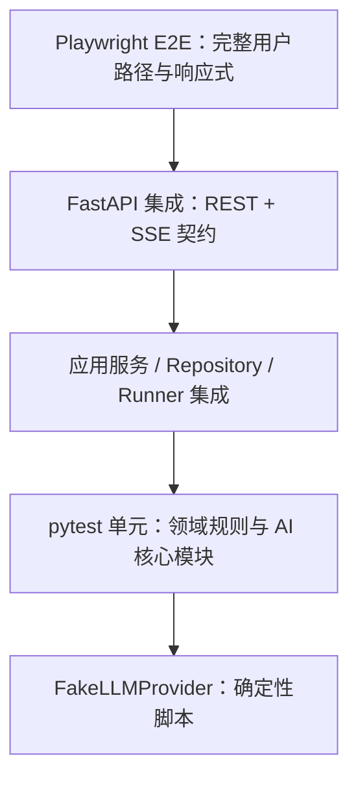
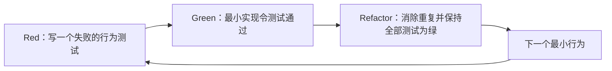

# AI Panel Studio MVP 测试策略（TDD + E2E 阶段）

> 文档状态：开发前测试设计｜v1.0｜2026-09-09
>
> 依据：`docs/01-prd.md` 至 `docs/05-ui-design.md`。本文定义后续实现应编写和执行的测试，不表示任何测试、覆盖率或质量门禁已经执行或通过。

## 1. 测试目标与原则

本 MVP 的主要风险不是页面是否能展示静态数据，而是模型非确定性、异步运行、SSE 事件顺序及多 Discussion 并发时的隔离。测试应优先证明领域规则、契约和用户可观察的实时行为，而不试图对 DeepSeek 的内容质量做不可重复的断言。

### 1.1 测试目标

- 证明 Discussion 生命周期、数量、归属与 15 条公开发言上限等领域规则受保护。
- 证明 CastGenerator、LLM 驱动的 FloorScheduler、InsightExtractor、DiscussionRunner 在可控输入下受既定约束保护。
- 证明 REST 与 SSE 符合既定 API 契约，且一个 Discussion 的事件/数据不能进入另一场。
- 证明 UI 能完成创建、确认、显式 Start、实时观察、结束和降级重试的关键路径。
- 证明任何公开 API、SSE、持久化对象或 UI 都不输出 Chain-of-Thought、内部发言意图、完整提示词或 API Key。

### 1.2 约束原则

1. 单元与服务测试使用 `FakeLLMProvider`，**不得**调用 DeepSeek、网络或真实 API Key。
2. 每个测试独立创建 SQLite 临时数据库和 Discussion 数据；不得依赖样例数据或执行顺序。
3. 异步测试必须有明确、短暂的超时，禁止无边界 sleep；等待以事件、状态或可观察条件为准。
4. 测试通过公开接口或领域行为断言结果，不断言提示词措辞、模型私有状态或实现私有变量。
5. 一个失败用例应先明确契约/规则，再写最小实现使其通过；禁止先堆实现、后补“证明性”测试。

## 2. 测试分层与运行边界



| 层级 | 工具 | 验证对象 | 模型/网络 |
| -- | -- | -- | -- |
| 领域与 AI 模块单元测试 | pytest | 实体规则、输出校验、调度、Insight 操作 | Fake；无网络 |
| 应用服务/Runner 集成测试 | pytest + 临时 SQLite | 状态转换、事务、事件发布、并发隔离 | Fake；无网络 |
| API 契约测试 | pytest + FastAPI 测试客户端 | HTTP 状态、JSON Schema、SSE 帧 | Fake；无网络 |
| 浏览器 E2E | Playwright | 页面交互、实时局部更新、响应式布局 | 启动测试后端 + Fake；无网络 |
| 手工烟雾检查（非自动化替代） | 本地浏览器 | 视觉细节与真实 DeepSeek 接入 | 仅明确配置时使用；不作为 CI 门禁 |

> 架构决策：真实 DeepSeek 只可用于开发者主动的手工烟雾检查，不能进入 pytest 或 Playwright 默认命令。这样保证测试成本、时延和结果可重复。

## 3. Red → Green → Refactor 的 TDD 工作流

每一个垂直切片遵循下列循环，而不是在项目末尾集中补测试：



### 3.1 工作单元

| 次序 | Red：先写的失败测试 | Green：最小通过行为 | Refactor：允许整理的边界 |
| -- | -- | -- | -- |
| 1 | 创建合法/非法 Discussion 与默认专家数 | 领域创建、2–8 校验、默认 4 | 提取值对象/枚举，不改 API 行为 |
| 2 | 生成阵容必须有 1 主持人和 N 专家 | Cast 输出校验并持久化至 `CAST_READY` | 提取 CastValidator 与颜色校验 |
| 3 | 非法生命周期转换被拒绝 | confirm/start/stop 状态守卫 | 统一状态转换错误映射 |
| 4 | 模型选人不得违反首轮、归属和连续发言限制 | FloorScheduler 校验选择结果与一次校正 | 保持模型选择输入最小 |
| 5 | 发言保存后才推送事件 | Runner 最小单回合 + EventHub | 提取事件构造/事务边界 |
| 6 | Insight 更新为当前完整活跃集合 | 替换活跃集合应用服务 | 抽取集合校验 |
| 7 | 第 15 条发言后收束 | Runner 停止调度、生成总结 | 整理终止条件与取消路径 |
| 8 | 两场讨论不串数据/事件 | 按 ID 的 repository、Runner、EventHub | 提取隔离守卫和测试工厂 |
| 9 | UI 显式 Start、SSE 局部更新 | 前端页面和测试服务端 | 整理组件、stores 和 selectors |

**Red 阶段要求**：测试名称应表达用户/领域行为，例如“当第 15 条公开发言已持久化时，不应请求第 16 次调度”。失败原因必须是缺少该行为，而不是未配置真实模型。

**Green 阶段要求**：只实现满足当前测试和既定契约的最小路径；不得趁机添加账号、聊天输入、云部署等范围外能力。

**Refactor 阶段要求**：重构前后运行同一组单元、集成和相关 E2E 测试；若需改契约，先更新 SDD 文档并新增/调整 Red 测试，不能静默改变接口。

**Git 过程要求**：每个 TDD 垂直切片先提交仅包含失败行为测试的 `test:` 提交并停止；开发者明确继续后，再以对应 `feat:` 提交最小 Green 实现和回归结果并再次停止。这样提交历史可真实呈现 tests → feat 的演进。

## 4. FakeLLMProvider 设计

### 4.1 职责与接口一致性

Fake 必须实现与 `LLMProvider` 相同的五个动作：`generate_cast`、`select_next_speaker`、`generate_turn`、`extract_insights`、`summarize`。`select_next_speaker` 返回模型选择的 speaker 与一句公开 `public_focus`；`generate_turn` 接受该已验证的 speaker，只返回公开发言和是否结束。它返回与生产 Provider 相同的结构化 DTO 或明确的受控异常；业务层不应通过 `isinstance(FakeLLMProvider)` 分支。

Fake 的目标不是模仿模型文采，而是让测试精确表达“本次调用应返回什么、应失败在哪里、调用了几次”。每个测试通过 fixture 注入独立脚本，默认没有全局可变的共享响应队列。

### 4.2 脚本化场景

| 场景 | Fake 行为 | 主要测试用途 |
| -- | -- | -- |
| `happy_path` | 返回合规阵容、合法选人/公开关注点、短发言、Insight、总结 | 主流程与 E2E |
| `invalid_cast_once` | 第一次阵容结构非法，第二次合规 | 验证一次校正重试 |
| `invalid_selection` | 选择跨场嘉宾、连续同人或带隐藏字段的输出 | 验证选人校验与 `FAILED` |
| `invalid_turn` | 为已选择 speaker 返回非法公开字段或发言 | 验证校验与 `FAILED` |
| `long_utterance` | 返回超过 2 句或长度限制 | 验证内容校验与不持久化 |
| `insight_failure` | 提炼 Insight 抛出受控异常 | 验证发言保留、旧 Insight 不丢失 |
| `summary_fail_twice_then_success` | 前两次总结失败，`retry-summary` 的第三次成功 | 验证 fallback 与固定重试脚本 |

> 设计决策：Fake 可记录每个动作的调用参数摘要、调用次数和调用顺序，供测试断言；记录不得包含真实 Key，也不应成为生产运行路径的一部分。

### 4.3 测试数据工厂

测试应提供 `DiscussionFactory`、`ParticipantFactory`、`UtteranceFactory`、`InsightFactory`，默认生成合法且同一 `discussion_id` 的对象。跨 Discussion 引用、重复 sequence、缺主持人、重复颜色等非法状态只能由显式参数构造，避免测试意图含糊。

## 5. pytest 单元测试设计

### 5.1 领域模型与 Schema

| 测试主题 | 关键断言 |
| -- | -- |
| Discussion 创建 | topic trim 后非空；专家数 2–8；缺省值为 4；`max_public_utterances=15` |
| 生命周期与确认 | 只允许 DRAFT→CAST_READY→RUNNING→FINISHED/FAILED；confirm 持久化确认字段；未确认 start 被拒绝 |
| Participant 完整性 | 合法角色枚举；颜色合法且 Discussion 内唯一；一场恰一主持人 |
| Utterance 完整性 | speaker 与 Discussion 同属；sequence 单调且唯一；内容 1–2 句且限长 |
| Insight 完整性 | type 枚举、归属正确；active 与更新时间维护正确 |
| 总结状态 | `FINISHED` 需 finished_at；成功为 `succeeded`，双失败为 `fallback`，仅 fallback 可重试 |

### 5.2 CastGenerator

| 场景 | 预期 |
| -- | -- |
| 合规模型输出 | 持久化 1 名主持人 + `expert_count` 名专家，状态进入 `CAST_READY` |
| CAST_READY 重新生成成功 | 单事务替换 Participant，重置确认字段，状态仍为 `CAST_READY` |
| CAST_READY 重新生成失败 | 旧 Participant 与确认字段完整保留 |
| 少/多角色 | 拒绝输出，不创建可确认半成品 |
| 两名主持人或无主持人 | 校验失败 |
| 重复颜色、非法 HEX、空职业/Title/stance | 校验失败 |
| 首次非法、第二次合规 | 仅一次校正重试后成功 |
| 两次非法/上游异常 | 保持 `DRAFT`，返回既定错误码 |

除了数量与字段，测试应断言“差异化”至少达到可客观检测的最低线：专家的 `stance` 不得完全重复。不得以主观文本优劣作为自动化断言。

### 5.3 FloorScheduler

FloorScheduler 的单元测试以固定 participants、发言历史和 Fake 的模型选择结果驱动；它不为模型评分，而是验证模型选择是否满足最小应用层约束。Fake 随后用于该角色的发言生成。

| 场景 | 预期 |
| -- | -- |
| 首轮 | 非主持人选择被拒绝；主持人选择通过 |
| 连续发言 | 有其他 Participant 时，选择上一位 speaker 被拒绝 |
| 跨场/不存在 speaker | Scheduler 拒绝任何不属于本场的 Participant |
| 合法选择 | 本场且满足最小约束的模型选择被接受，并保留其公开关注点 |
| 公开字段 | `public_focus` 为最长 50 字符的单句文本；额外 reasoning/intent 字段被拒绝 |
| 15 条边界 | 第 15 条已保存后不调用下一次 generate_turn，转入总结 |
| 用户 stop | 取消标记出现后不再开始下一轮调度 |

“非机械轮流”不是要求测试预测某个固定身份：测试只验证完整上下文传入 Provider，以及首轮、归属、连续发言这些负向约束。

### 5.4 InsightExtractor

| 场景 | 预期 |
| -- | -- |
| 新共识/分歧 | 创建正确 type、active=true 的 Insight |
| 完整集合替换 | 下一轮活跃集合替换上一轮，不累计重复内容 |
| 跨场隔离 | 仅替换目标 Discussion 的集合，不能改写别场数据 |
| 非法 type/空内容/超过每类两项 | Pydantic/服务校验失败；不产生部分更新 |
| 提炼失败 | 已保存 Utterance 保留，上轮 active Insights 不丢失 |

### 5.5 Chain-of-Thought 安全单元测试

安全测试不尝试“检测所有秘密思考”，而验证已定义的边界不会意外输出或持久化不允许的字段与标记。

| 攻击/错误输入 | 必须断言 |
| -- | -- |
| Fake 在 SpeakerSelectionOutput 返还 `reasoning`、`chain_of_thought`、`internal_intent` 等额外字段 | Selection Schema 以 extra-forbid 拒绝；一次校正后仍非法则进入 `FAILED`，持久化/API DTO 无此字段 |
| Fake 在 Utterance 返还 intent 或调度解释 | 公共 Utterance 只保留 `content`；SSE 不含 intent |
| Fake 在总结返还 JSON 包装/调试字段 | UI/API 仅消费自然语言 summary；禁止原始 JSON 直出 |
| 服务错误 details 含 API Key 模式文本 | 错误净化后不含敏感值 |
| Fake 返回超过 50 字符或多句的 `public_focus` | Selection Schema 拒绝；原文不得写库或推送 |

> 架构决策：`public_focus` 由模型作为独立公开字段生成，且服务端不请求隐藏推理。测试验证结构、长度、单句限制和额外字段拒绝，而不尝试检测模型私有思考。

## 6. Runner、持久化与多 Discussion 集成测试

### 6.1 DiscussionRunner

| 场景 | 可观察断言 |
| -- | -- |
| 启动成功 | 仅在 `CAST_READY`、已确认后创建 Runner；Discussion 变为 `RUNNING` |
| 重复 start | 同一 ID 不创建第二 Runner，返回 `409` 或等价冲突 |
| 单轮顺序 | 模型选人并经校验 → `preparing` → `speaking` → 调用 generate_turn → Utterance 持久化 → `utterance.created` → Insight 更新（若成功）→ 持久化 `idle + public_focus=null` → `participant.status.changed(idle)`；发言事件不会早于数据库提交，最终 SQLite Participant 为 idle/null |
| 停止 | 不开启下一轮，完成总结/降级后 `FINISHED` 并发 `discussion.finished` |
| 第 15 条 | 保存第 15 条后收束，不保存第 16 条 |
| 发言校验失败 | 不持久化非法 Utterance；Runner 发 `discussion.error` 并进入 `FAILED` |
| Insight 失败 | Utterance 已保存且已发事件；保留既有 Insights；Runner 继续下一轮 |
| 总结失败 | 内部重试一次；两次失败仍 `FINISHED` + `summary_status=fallback` |
| retry-summary | 仅 fallback 的 FINISHED 可受理；不启动 Runner、不追加 Utterance；成功更新 summary/status |

Runner 测试使用可控时钟或事件门闩（barrier/event）推进每一轮，而不依赖真实时间等待。每个测试结束必须取消 task、关闭 subscriber，避免泄漏到下个测试。

### 6.2 多 Discussion 隔离

至少同时构造 Discussion A 与 B，并在 A 运行/更新时对 B 做负向断言：

| 层面 | A 的操作 | B 必须保持 |
| -- | -- | -- |
| Repository | 保存 A 的 Participant/Utterance/Insight | 查询 B 不返回 A 记录；跨场外键被拒绝 |
| Runner Registry | 启动 A | B 没有 Runner；启动 B 后两 Runner ID 不同 |
| EventHub/SSE | 向 A 发布状态、发言、Insight | B subscriber 收不到任何 A event |
| 失败处理 | A Provider 故障 | B 保持 `RUNNING` 并可继续事件流 |
| 前端状态（E2E） | A 收到新增发言 | B 页面不出现 A 的主题、姓名、内容或进度 |

该组测试须故意使用不同话题、不同 participant 名称及唯一文本，以便精确检测串场，而非仅比对数量。

## 7. API 与 SSE 契约测试

### 7.1 REST API

| 接口 | 最小正向断言 | 关键失败断言 |
| -- | -- | -- |
| `GET /api/discussions` | 返回全部状态、按 updated_at 倒序的 `items` | 存储故障为统一错误格式 |
| `POST /api/discussions` | 缺省专家数为 4，返回 `DRAFT` 和 15 上限 | 空 topic、1/9 名专家为 `422` |
| `GET /api/discussions/{id}` | 返回同场聚合快照和合法 DTO | 不存在为 `404`；不含其他场子资源 |
| `generate-cast` | DRAFT 首次生成；CAST_READY 原子替换并重置确认 | 其他状态为 `409`；失败保留旧阵容 |
| `confirm` | 仅合规未确认阵容可持久化确认字段 | 草稿/不完整/已确认阵容为 `409` |
| `start` | 已确认阵容返回 `202` + `RUNNING`，不重复启动 | 未确认、非 `CAST_READY` 或重复 start 为 `409` |
| `stop` | `202` stop_requested，最终事件结束 | 非 `RUNNING` 为 `409` |
| `retry-summary` | fallback FINISHED 返回 `202/pending` | 非 fallback 或非 FINISHED 为 `409` |

所有失败响应均断言 `error.code`、`error.message`、`error.details` 三字段存在，且不包含 Key、CoT、内部 intent 或堆栈文本。

### 7.2 SSE

SSE 集成测试以测试客户端打开 A、B 两条 `/events` 流，并按帧解析 `event` 与 JSON `data`。

| 场景 | 断言 |
| -- | -- |
| 初次连接 | 第一条为 `discussion.snapshot`，其 discussion 与 GET 详情完整 DTO 同构且 ID 正确 |
| 状态事件 | `participant.status.changed` 只含用户可见状态和 `public_focus` |
| 发言事件 | `utterance.created` 在数据库含该 ID/sequence 后才收到，且不含 intent |
| Insight 事件 | `insights.updated` 包含本场完整活跃集合，可直接替换 UI 状态 |
| 结束事件 | `discussion.finished` 包含状态、summary、summary_status、finished_at |
| 错误事件 | `discussion.error` 含统一 error、`final_status=FAILED`；状态已持久化且敏感信息已净化 |
| 事件隔离 | A 流不出现 B 的任意 event/data；反之亦然 |
| 断连重连 | 重新连接的第一条仍为完整 snapshot；MVP 不断言回放或去重 |

事件测试不假定跨事件绝对时间，只断言单轮因果顺序（持久化在发言事件前、结束后不再自动发言）。

## 8. Playwright E2E 设计

### 8.1 测试环境

Playwright 启动 Vite 前端和 FastAPI 测试服务；后端通过环境配置使用 `FakeLLMProvider` 和独立临时 SQLite 文件。Fake 场景由测试专用、非生产暴露的启动配置选择，不能让浏览器直接注入模型结果或 API Key。

测试中对动态内容使用语义定位器（角色、可见中文文案、稳定 `data-testid`）；避免按颜色、动画时长或 DOM 层级脆弱定位。实时步骤等待 API/页面状态或明确事件结果，不使用固定长 sleep。

### 8.2 必须覆盖的 E2E 场景

#### E2E-01：完整讨论流程

1. 打开首页，点击“发起讨论”。
2. 输入中文话题，确认默认专家数为 4，生成阵容。
3. 核验 1 位主持人与 4 位专家的公开卡片字段，确认阵容。
4. 到达演播厅待开始状态，断言此时存在“开始讨论”且尚未有自动发言。
5. 点击 Start；等待 Fake 推送状态、至少一条发言和至少一项 Insight。
6. 断言 Transcript 显示姓名、职业/Title、正文，不显示 `challenge`、`rebuttal`、`reasoning`、`举手` 等内部词字段。
7. 推进到第 15 条公开发言和 `discussion.finished`，断言停止按钮消失、总结卡显示自然语言、页面为只读。

#### E2E-02：多 Discussion 隔离

1. 在同一浏览器上下文创建 A、B 两场使用不同主题/嘉宾名/发言文本的 Discussion。
2. 在两个页面或两个独立 Page 中分别 Start A、B。
3. 推进 A 的 Fake 发言及 Insight，断言 B 页面没有出现 A 的文本、名称、发言计数或 Insight。
4. 让 A 触发受控模型错误，断言 B 仍显示 `RUNNING` 并可继续收到自己的事件。

#### E2E-03：响应式与滚动

1. 以一个桌面视口和 `390px` 窄屏视口打开同一运行中 Discussion。
2. 桌面断言嘉宾、Transcript、Insights 同时可见且各自可滚动；页面外层不因讨论内容产生主滚动。
3. 窄屏断言状态摘要→Transcript→Insights 的视口内分区，嘉宾横向轨道及关键 Start/停止控件均可访问，且不依赖整页滚动。
4. 将 Transcript 滚动到历史位置，推送新 Utterance，断言显示“有 N 条新发言”且滚动位置不被强制跳到底部；点击提示后回到底部。

#### E2E-04：关键错误——总结降级与重试

1. 使用 `summary_fail_twice_then_success` 固定脚本完成一场讨论。
2. 断言 Discussion 仍显示已结束、全部历史发言和 Insights 仍保留、总结卡显示“总结暂不可用”。
3. 断言唯一“重试总结”操作可用；点击后显示 pending/loading，不重新生成 Utterance。
4. 固定脚本的第三次 summarize 成功；等待结束事件，断言自然语言总结替换降级状态。

### 8.3 可选但建议的 E2E

- 首页显示 `DRAFT`、`CAST_READY`、`RUNNING`、`FINISHED`、`FAILED` 状态卡及正确主操作。
- 创建页边界：2 和 8 可提交，1 和 9 显示字段错误。
- SSE 重连后服务端发送 snapshot，页面以 snapshot 恢复本场状态。

## 9. 测试目录、命名与数据治理

建议目录（为后续实现的测试组织，不是已存在代码）：

```text
backend/tests/
  unit/
    test_domain_rules.py
    test_cast_generator.py
    test_floor_scheduler.py
    test_insight_extractor.py
    test_public_output_safety.py
  integration/
    test_discussion_runner.py
    test_discussion_isolation.py
    test_api_contract.py
    test_sse_events.py
  conftest.py
e2e/
  discussion-flow.spec.ts
  discussion-isolation.spec.ts
  responsive-studio.spec.ts
  summary-retry.spec.ts
```

- 命名采用 `test_when_<condition>_then_<observable_result>` 或同等清晰中文/英文语义；一个测试只验证一个主要行为。
- 每个 pytest 测试有独立临时 SQLite 文件/事务；每个 E2E spec 使用独立数据库命名空间或前置清理，禁止共享上一个用例状态。
- 固定时间、UUID、Fake 响应脚本和事件顺序，避免随机性；若使用随机生成，必须注入可记录 seed。
- 失败时保留 Playwright trace、截图、视频（如测试配置允许）及经脱敏的服务日志；不得保存 API Key、原始隐藏提示词或 CoT。

## 10. 质量门禁与非目标

### 10.1 建议门禁顺序

1. 格式、类型检查与 pytest 单元测试。
2. pytest 集成/API/SSE 测试。
3. Playwright 的四个必须场景。
4. 开发者可选的真实 DeepSeek 手工烟雾检查，与自动测试结果分开报告。

覆盖率百分比不是本阶段的验收替代物，因此本文不承诺目标数值。合并/交付前应以“领域规则、契约场景和必需 E2E 是否通过”作为质量门禁；若未来设阈值，应在实现前写入 CI 配置及文档。

### 10.2 明确不测或不做

- 不在自动化测试中评判模型观点是否“足够有深度”、文风是否像真人或议题结论是否正确。
- 不用真实 DeepSeek 调用测试费用、限流或模型质量。
- 不为 MVP 测试未定义的登录、权限、支付、音视频、搜索、社交功能。
- 不记录、快照或断言隐藏 Chain-of-Thought；安全测试只验证不泄露边界。
- 不以固定 sleep、共享数据库或依赖测试执行次序获得偶然稳定性。

## 11. TDD + E2E 阶段验收清单

- [ ] 每个核心模块先有可复现的 Red 测试，再进入最小 Green 实现和 Refactor。
- [ ] `FakeLLMProvider` 覆盖正常、非法阵容一次、非法选人、非法发言、Insight 失败、固定总结降级与重试、多 Discussion 隔离。
- [ ] CastGenerator、FloorScheduler 的最小选择约束、InsightExtractor 的完整集合替换由 pytest 直接验证。
- [ ] Runner 覆盖事务→事件顺序、停止、15 条上限、总结重试和资源清理。
- [ ] API 和 SSE 测试覆盖成功、状态冲突、统一错误格式及所有规定事件。
- [ ] 至少一组测试从数据库、Runner、SSE、前端四层证明多 Discussion 不串场。
- [ ] CoT/内部 intent/API Key 不会出现在持久化公开字段、REST、SSE、UI、测试产物或错误响应。
- [ ] Playwright 覆盖完整流程、多 Discussion 隔离、一个桌面与一个窄屏的响应式/自动滚动、总结降级与重试；超宽屏作为手工 smoke。
- [ ] 自动测试默认不访问真实 DeepSeek、网络或真实 API Key。
